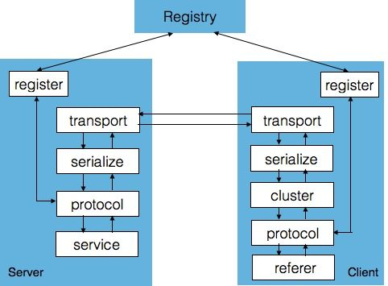

# **Linux平台开源组件微服务通信库**

[](https://travis-ci.org/alibaba/fastjson)
[](https://codecov.io/gh/alibaba/fastjson/branch/master)
[](https://maven-badges.herokuapp.com/maven-central/com.alibaba/fastjson/)
[](https://github.com/alibaba/fastjson/releases)
[](https://www.apache.org/licenses/LICENSE-2.0.html)

Component (module, plugin, process  (like dbus)) rpc server daemon and client library，
make component communicating easier,using epoll event with unix socket and internet tcp/udp socket and etc.

### __主要特性包括:__
 * 支持模块间，进程间，跨网络的主机的远程调用，让通信方式更加简单，不用关注底层通信的实现
 * 支持客户端服务注册认证，目前暂时支持CHAP认证方式，保证远程调用的客户端是可信的一方
 * 支持HEAD + DATA协议方式保证数据边界，支持数据部分二进制格式，JSON格式，XML格式序列化
 * 支持Epoll事件驱动，支持unix，netlink，tcp，udp socket等多种通信方式，可根据场景灵活选取
 * 支持接收发送方向的多线程处理方案，可根据配置文件修改线程数，适配SMP主机多线程性能提升
 * 支持进程，多线程绑核方案，通过roundbin分配连接，充分利用CPU资源，让各个线程达到负载均衡 
   (其他：随机、一致性哈希、roundbin三种负载均衡算法)
 * 支持多IO聚合提升性能，支持大IO的半发送的处理
 * 客户端和服务端支持0-8K的预先分配+动态分配的内存缓存分配，有效提高分配效率和减少内存碎片
 * 客户端支持超时同步和异步两种远程调用方式
 * 客户端支持限流和及时熔断 （待实现）
 * 客支持事件消息订阅 （待实现）
 * 支持主从节点故障迁移（zookeeper，redis etc）（待实现）
 * 支持客户端协议透明通信代理（待实现）
 


## __快速开始__
### 安装环境
```xml
安装Ubuntu, Debian等Linux, ARM环境
测试环境（Linux KaliCI 4.19.0-kali3-amd64）: gcc version 8.2.0 (Debian 8.2.0-14)
测试环境（Linux raspberrypi 4.14.52-v7+）：gcc version 6.4.1 20171012 (Linaro GCC 6.4-2017.11)
```
### 下载开源库

- [微服务框架库][1]
``` groovy
git clone https://github.com/wypx/libmsf/
```
- [微服务通信框库][2]
``` groovy
git clone https://github.com/wypx/librpc/
```

[1]: https://github.com/wypx/libmsf/
[2]: https://github.com/wypx/librpc/

Please see this [Wiki Download Page][Wiki] for more repository infos.

[Wiki]: https://github.com/wypx/mobile

### 编译开源库
```xml
root@KaliCI:/media/psf/tomato/mod/mobile make
Make Subdirs msf
make[1]: Entering directory '/media/psf/tomato/mod/libmsf/msf
arm-linux-gnueabihf-gcc lib/src/msf_log.o
.................
make[1]: Leaving directory '/media/psf/tomato/mod/libmsf/msf_daemon

root@KaliCI:/media/psf/tomato/mod/librpc/server make
arm-linux-gnueabihf-gcc bin/src/conn.o
arm-linux-gnueabihf-gcc bin/src/config.o
.......
```xml

msf_agent  各个服务进程之间的通信代理服务端程序
msf_dlna   测试程序 - 独立微服务进程客户端DLNA
msf_upnp   测试程序 - 独立微服务进程客户端UPNP
msf_daemon 用于守护监控代理进程msf_agent
msf_shell  壳子程序，用于记载配置文件中的插件
msf_mobile 独立编译的mobile拨号程序

libipc.so 提供给各个微服务进程连接的通信代理客户端库
libipc.so 提供给各个微服务进程的基础设施库
          包括：网络 管道 Epoll等事件驱动 日志 共享内存 内存池 
          串口通信 线程 进程 CPU工具 文件 加密 微服务框架 定时器
```

### 运行开源库
```xml
1. 执行样例程序
   $ ./msf_agent
2. 查看运行日志
   运行结果
```

### 硬件平台适配
``` groovy
根据开发者目标平台以的不同，需要进行相应的适配
```

### ___参考文章___
- [librpc源码解析](http://luotang.me/raspberry_mobile.html)

### *License*

Libmsf is released under the [Gnu 2.0 license](license.txt).
```
/**************************************************************************
*
* Copyright (c) 2017-2019, luotang.me <wypx520@gmail.com>, China.
* All rights reserved.
*
* Distributed under the terms of the GNU General Public License v2.
*
* This software is provided 'as is' with no explicit or implied warranties
* in respect of its properties, including, but not limited to, correctness
* and/or fitness for purpose.
*
**************************************************************************/
```
